# Problem 1

1. We import dataset into the global env with following code

```R
> library(readr)
> tute1 <- read_csv("Downloads/tute1.csv")
```

2. We use `autoplot` the graphically show the dataset

```R
> tute1 = ts(tute1[,-1],start = 1981, frequency = 4)
> library(fpp2)
> autoplot(tute1, facets = TRUE)
```

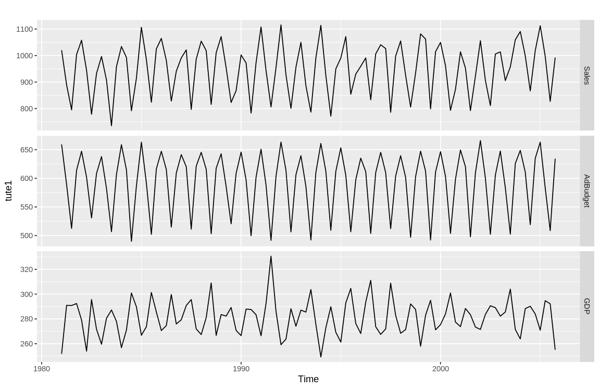

now we try without `facets = TRUE` we have

```R
> autoplot(tute1)
```

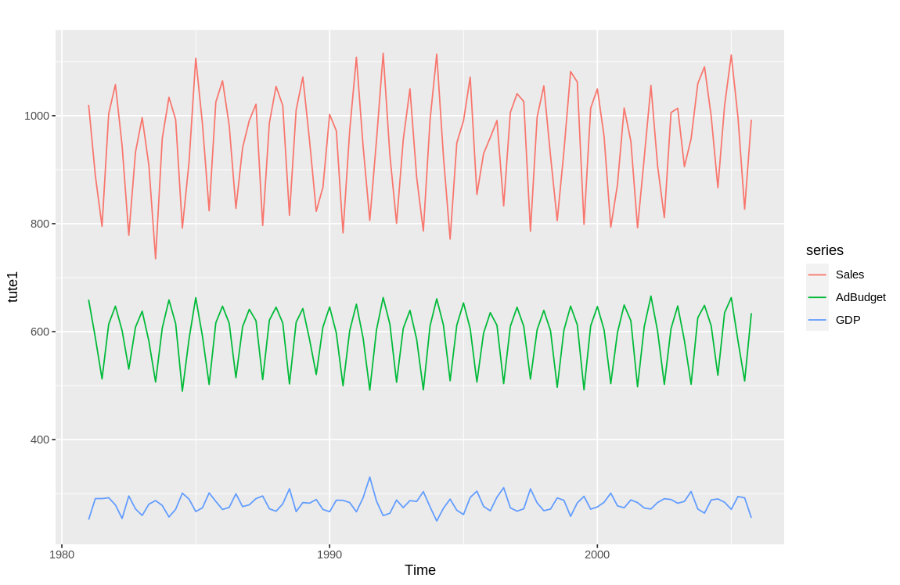

As we can see, with `facets = TRUE`, the image will spend different columns in different subplots. This is useful if the series having different scales.

Whereas if no parameter is passed and the default `facets = FALSE` is used, then it will draw different columns (series) in the same plot.

# Problem 2

## 2.a

We import the dataset with

```R
> retaildata <- readxl::read_excel("retail.xlsx", skip=1)
```

Alternatively, we can also import the data using GUI, note that we need to set `Skip = 1` to drop the first row.

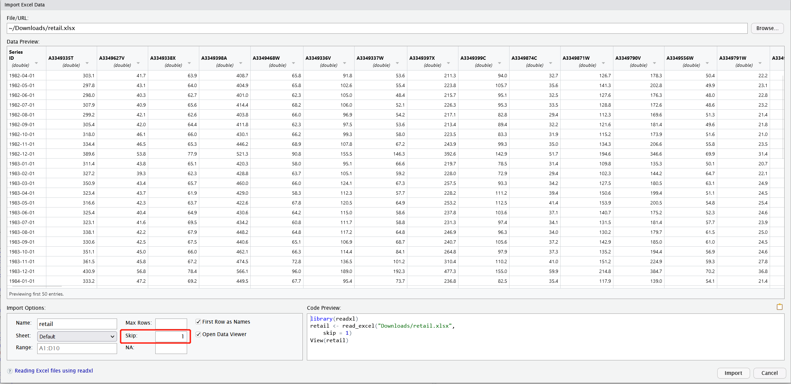

## 2.b

Now we choose column `A3349414R`, the turnover of Victoria liquor sales

```R
> liquor <- ts(retaildata[, "A3349414R"], frequency = 12, start = c(1982, 4))
```

## 2.c

1. we use `autoplot` to view the general pattern of our data

```R
> autoplot(liquor)
```

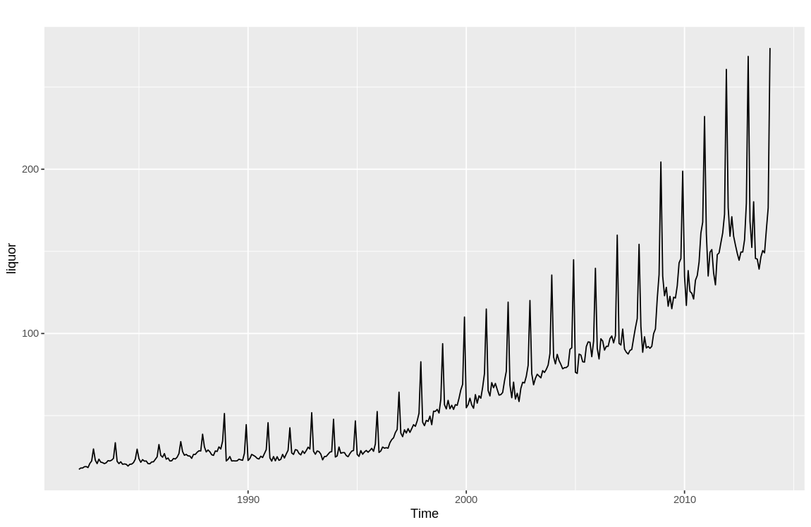

As we can see, the data is showing strong trend and seasonal features.

2. we use `ggseasonplot` to exam the seasonal pattern

```R
> ggseasonplot(liquor)
```

The series in each year are showing seasonal pattern, sales are high during Nov. to Mar. While relatively low in the rest of the year.

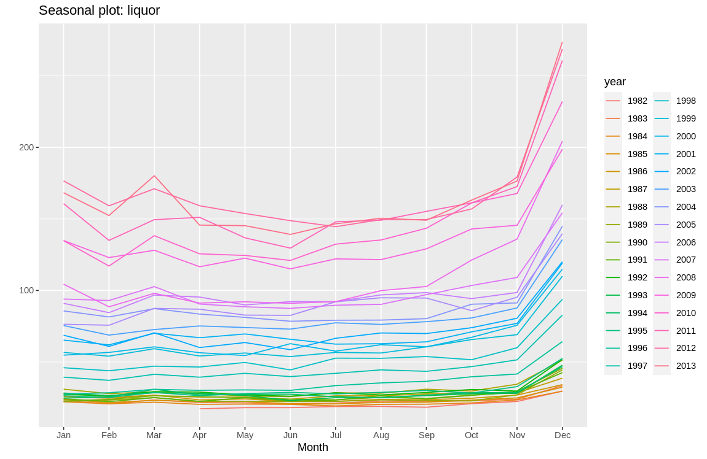

3. use `ggsubseriesplot` and `gglagplot` to exam the trend in seasonal pattern

```R
> ggsubseriesplot(liquor)
```

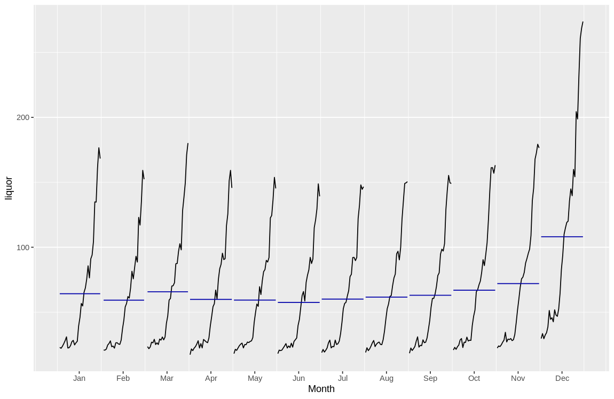

```R
> gglagplot(liquor)
```

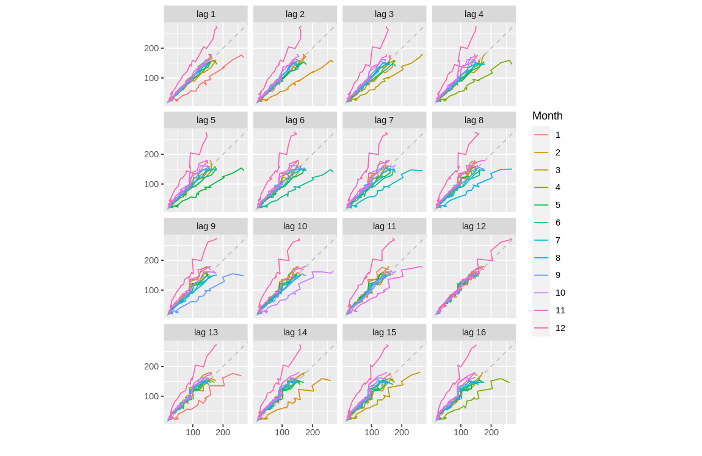

The plots compares the sales of same month, which is showing a clear upwards trend.

4. use `ggAcf` to exam auto-correlation

```R
> ggAcf(liquor)
```

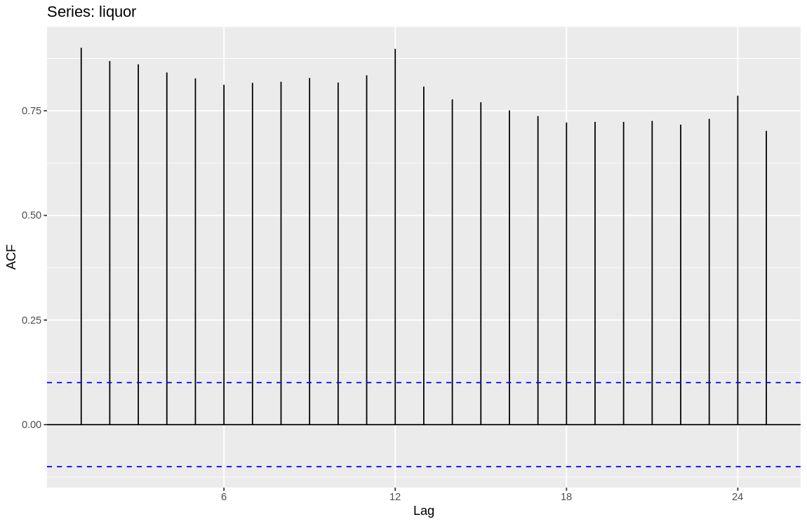

The auto-correlation of the data is significant.

Overall we can find significant seasonal characteristics in the data, as well as a strong upward trend.

# Problem 3

We use `BoxCox.lambda` function to calculate the lambda for our transformation.

```R
> lambda <- BoxCox.lambda(liquor)
> lambda
[1] -0.04159144
```
```R
> liquor_transformed <- BoxCox(liquor, lambda)
```

The transformed data is shown as below.

```R
> plot_data <- data.frame(year = time(liquor), liquor = liquor, liquor_transformed = liquor_transformed)
>
> coeff = liquor[length(liquor)] / liquor_transformed[length(liquor_transformed)]
> intercept <- liquor_transformed[1] * coeff - liquor[1]
>
> ggplot(plot_data, aes(x = year)) +
+     geom_line(aes(y = liquor, color = "Original Liquor")) +
+     geom_line(aes(y = liquor_transformed * coeff - intercept, color = "Transformed Liquor")) +
+     scale_color_manual(name = "Y series", values = c("Original Liquor" = "blue", "Transformed Liquor" = "red")) +
+     labs(y = "Original Liquor") +
+     scale_y_continuous(sec.axis = sec_axis(trans = ~ (. + intercept) / coeff,name = "Transformed Liquor"))
```

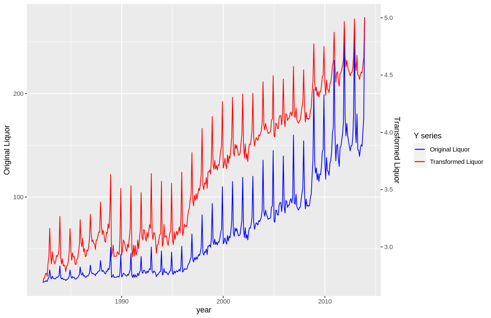

# Question 4

1. split the data into training and test set

```R
> liquor.train <- window(liquor, end=c(2010,12))
> liquor.test <- window(liquor, start=2011)
```

2. plot the training and test set

```R
> autoplot(liquor) 
+     autolayer(liquor.train, series="Training") 
+     autolayer(liquor.test, series="Test")
```

and we have 

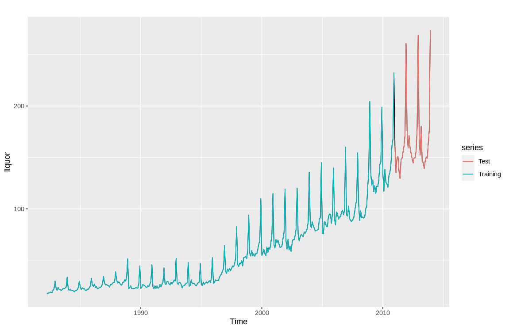

3. calculate the seasonal naive forecast

```R
> fc <- snaive(liquor.train)
> fc
         Point Forecast    Lo 80    Hi 80     Lo 95    Hi 95
Jan 2011          134.8 123.6507 145.9493 117.74858 151.8514
Feb 2011          117.1 105.9507 128.2493 100.04858 134.1514
Mar 2011          138.3 127.1507 149.4493 121.24858 155.3514
Apr 2011          125.6 114.4507 136.7493 108.54858 142.6514
May 2011          124.5 113.3507 135.6493 107.44858 141.5514
Jun 2011          121.0 109.8507 132.1493 103.94858 138.0514
Jul 2011          132.4 121.2507 143.5493 115.34858 149.4514
Aug 2011          135.3 124.1507 146.4493 118.24858 152.3514
Sep 2011          143.5 132.3507 154.6493 126.44858 160.5514
Oct 2011          161.2 150.0507 172.3493 144.14858 178.2514
Nov 2011          167.8 156.6507 178.9493 150.74858 184.8514
Dec 2011          232.1 220.9507 243.2493 215.04858 249.1514
Jan 2012          134.8 119.0325 150.5675 110.68565 158.9143
Feb 2012          117.1 101.3325 132.8675  92.98565 141.2143
Mar 2012          138.3 122.5325 154.0675 114.18565 162.4143
Apr 2012          125.6 109.8325 141.3675 101.48565 149.7143
May 2012          124.5 108.7325 140.2675 100.38565 148.6143
Jun 2012          121.0 105.2325 136.7675  96.88565 145.1143
Jul 2012          132.4 116.6325 148.1675 108.28565 156.5143
Aug 2012          135.3 119.5325 151.0675 111.18565 159.4143
Sep 2012          143.5 127.7325 159.2675 119.38565 167.6143
Oct 2012          161.2 145.4325 176.9675 137.08565 185.3143
Nov 2012          167.8 152.0325 183.5675 143.68565 191.9143
Dec 2012          232.1 216.3325 247.8675 207.98565 256.2143
```

4. Calculate the accuracy

```R
> accuracy(fc, liquor.test)
                    ME      RMSE       MAE      MPE      MAPE     MASE      ACF1 Theil's U
Training set  4.455255  8.699864  5.818619  6.15400  9.948117 1.000000 0.7261600        NA
Test set     19.170833 22.956217 19.520833 11.59039 11.813322 3.354891 0.5801161 0.7479721
```

4. check the residual with 

```R
> checkresiduals(fc)

	Ljung-Box test

data:  Residuals from Seasonal naive method
Q* = 783.91, df = 24, p-value < 2.2e-16

Model df: 0.   Total lags used: 24
```

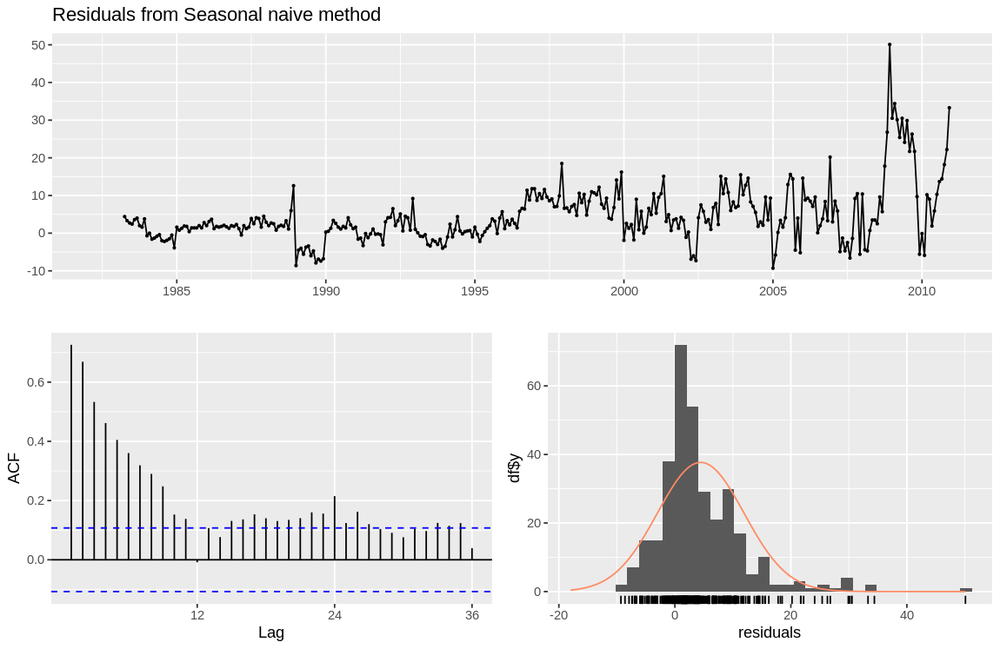

as we can see from the ACF plot, the residuals are having significant auto-correlation.

the distribution graph is showing residual suffers from fat tail. The distribution is far from normal.

5. now we compare the accuracy from 10%, 20%, 30%, 40% split of training, test set

```R
index <- time(liquor)
accuracy_results <- list()

# Loop through different splits (10%, 20%, 30%, 40%)
for (split_percentage in c(0.1, 0.2, 0.3, 0.4)) {
  split_index <- ceiling(length(index) * (1 - split_percentage))
  liquor.train <- window(liquor, end = index[split_index])
  liquor.test <- window(liquor, start = index[split_index + 1])
  
  fc <- snaive(liquor.train)
  acc <- accuracy(fc, liquor.test)[2, ]
  accuracy_results[[as.character(split_percentage)]] <- acc
}
accuracy_df <- do.call(rbind, accuracy_results)
```

```R
> print(accuracy_df)
           ME      RMSE       MAE       MPE      MAPE     MASE        ACF1 Theil's U
0.1 21.791667 26.223320 22.141667 12.972594 13.195524 3.893997  0.56589226 0.8766350
0.2 16.441667 22.791300 17.783333 12.956038 14.192135 3.899504  0.79441842 0.9984541
0.3  5.920833  8.718634  7.179167  6.111223  7.764106 1.675226  0.49642568 0.4649661
0.4  4.512500  6.532005  5.529167  6.100946  7.805474 1.434688 -0.02042785 0.3998734
```

We can observe an increase in RMSE, MAE, MPE and other accuracy measurements as the training set size increases. This is generally **counter-intuitive**.
- This may come from the gradual increase in the residuals.
- The residuals of the forecast in the relative old data are small and of the "new" data are large.
- Therefore including more of older data in the test set will increase the prediction accuracy instead of decreasing it.