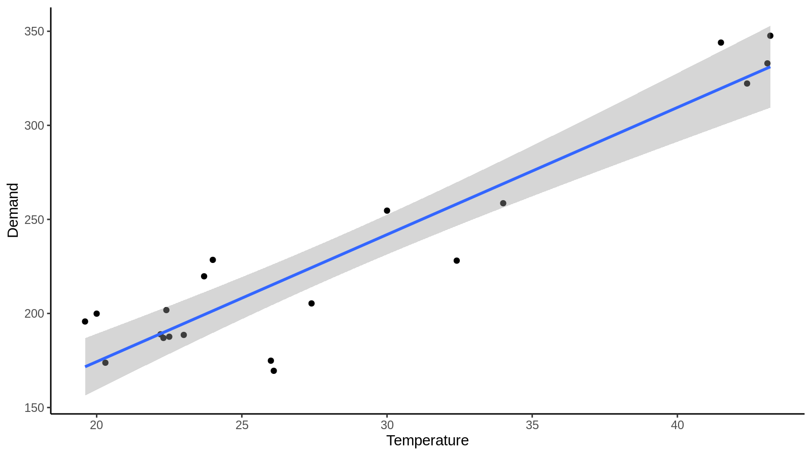
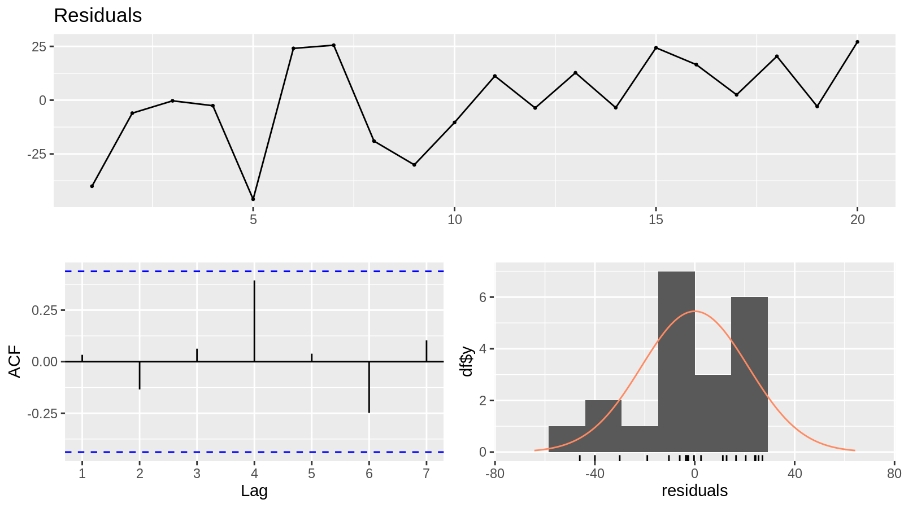
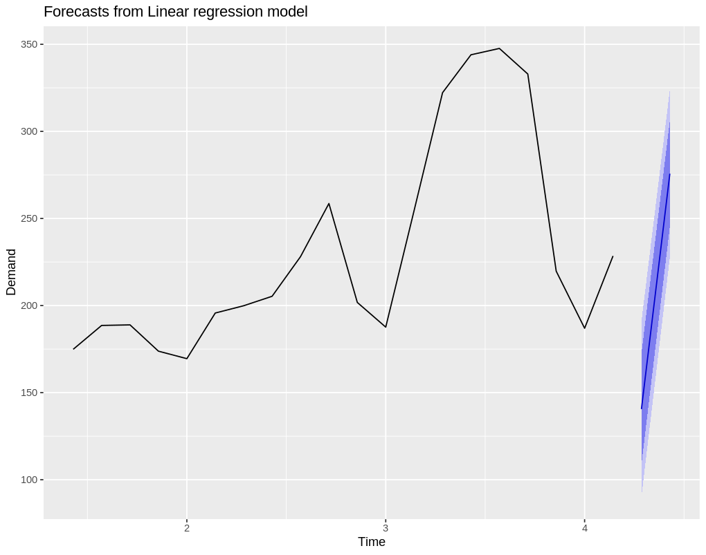
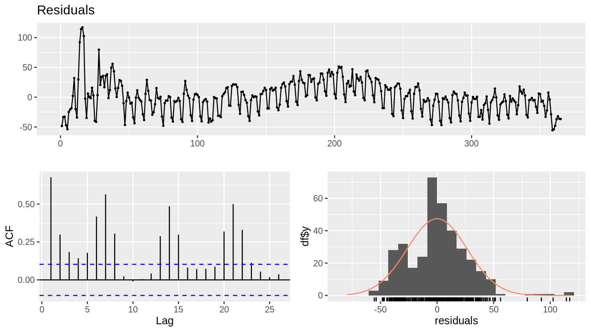
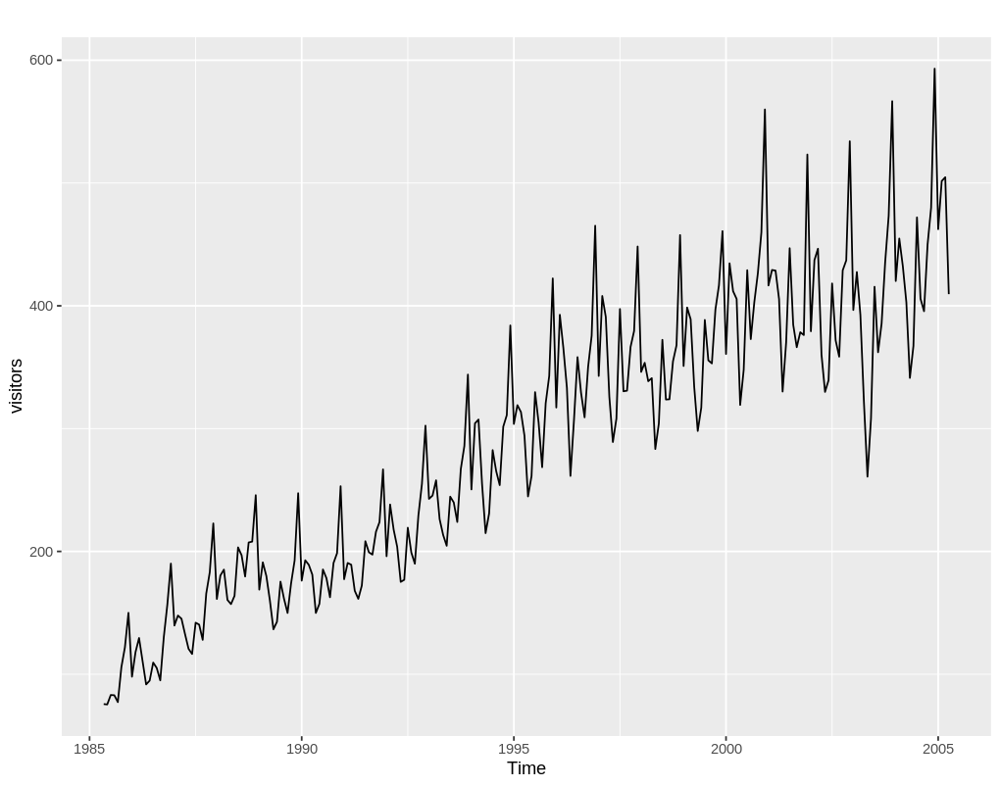
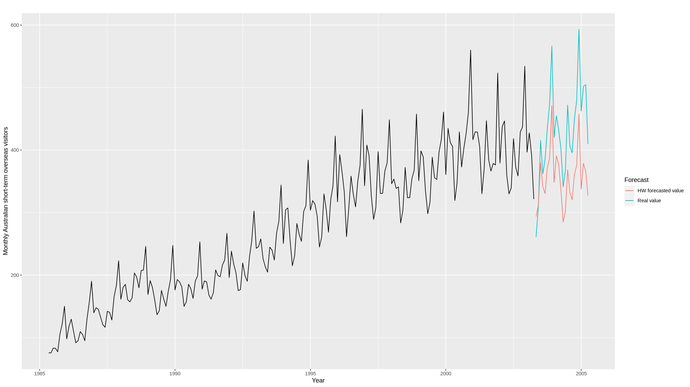
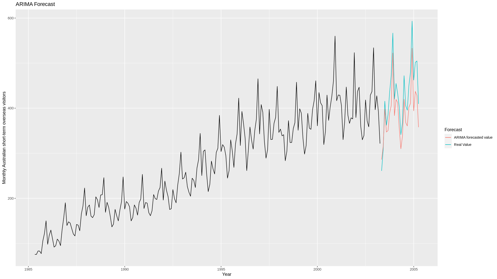
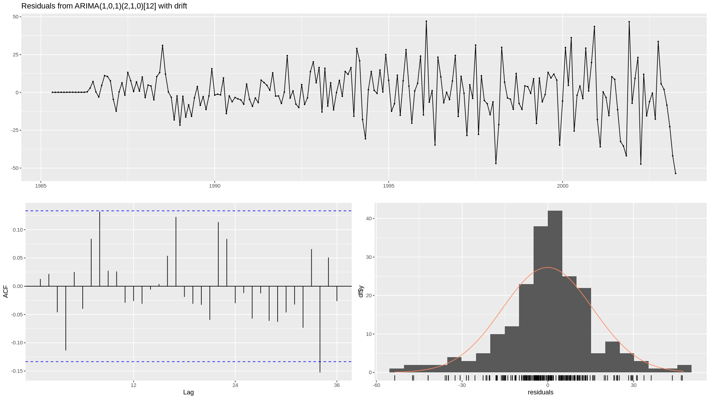
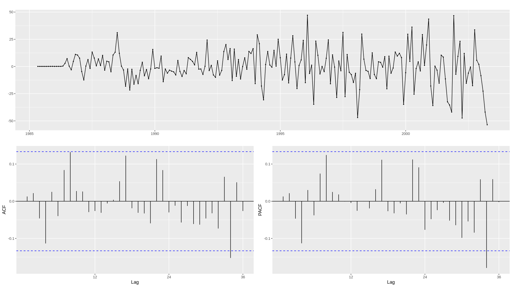

# Question 1

## 1.a

to plot the scatter graph and show the linear relationship of Temperature and Demand, execute following codes

```R
library(fpp2)
daily20 <- head(elecdaily, 20)
daily20 <- as.data.frame(daily20)
ggplot(daily20) + 
    geom_point(mapping = aes(x = Temperature, y = Demand)) + 
    geom_smooth(method = 'lm', mapping = aes(x = Temperature, y = Demand)) + 
    theme_classic()
```

We have



the params of the fit is 

```R
> fit <- lm(Demand ~ Temperature, data = daily20)
> summary(fit)

Call:
lm(formula = Demand ~ Temperature, data = daily20)

Residuals:
    Min      1Q  Median      3Q     Max 
-46.060  -7.117  -1.437  17.484  27.102 

Coefficients:
            Estimate Std. Error t value Pr(>|t|)    
(Intercept)  39.2117    17.9915   2.179   0.0428 *  
Temperature   6.7572     0.6114  11.052 1.88e-09 ***
---
Signif. codes:  0 ‘***’ 0.001 ‘**’ 0.01 ‘*’ 0.05 ‘.’ 0.1 ‘ ’ 1

Residual standard error: 22 on 18 degrees of freedom
Multiple R-squared:  0.8716,	Adjusted R-squared:  0.8644 
F-statistic: 122.1 on 1 and 18 DF,  p-value: 1.876e-09
```

Possible explanation of the positive relationship between Temperature and Demand is that household use more AC when weather is hot, which consume more power.

## 1.b

continued from above, to create a residual plot, use command

```R
checkresiduals(fit)
```



Noted, using the first 20 as training set is too small to draw a stable conclusion, considering using all of the data.

The residual plotting is showing
- the model is **not** adequate, as residual distribution is far from normal
- the residual is having some significant outliers.
- since the fitting is using losse, the algorithm is exposed to the outliers influence
- the data is showing strong seasonal effect

## 1.c

```R
> predict(fit, newdata = list(Temperature = c(15, 35)))
       1        2 
140.5701 275.7146
```

the prediction of Temperature = 15 and 35 is, respectively, 140.5701 and 275.7146

the predicted value varies so largely that is highly unlikely to be accurate.

this might comes from a result of
- not taking seasonal effect in to account
- training sample is too small

```R
> predict(fit.all, newdata = list(Temperature = c(15,35)))
       1        2 
218.6592 227.0242 
```

the model using whole data set is much more stable.

## 1.d

```R
fit <- tslm(Demand ~ Temperature, data=head(elecdaily, 20))
r <- forecast(fit, newdata=data.frame(Temperature=c(15,35)))
autoplot(r)
```



the plot is showing the prediction intervals for our forecasts

## 1.e

```R
fit.all = lm(Demand ~ Temperature, data = as.data.frame(elecdaily))
checkresiduals(fit.all)
```

the result is shown below




The result shows
- the model show take seasonal effect into account
- the model is showing strong auto-correlation.
- the first 20 observation is not a good representative of the population
- the residual is showing correlation with the Temperature, indicating Endogeneity issue

# Question 2

## 2.a

```R
library(fpp2)
autoplot(visitors)
```



the plot shows that
- the data contains tend component and seasonal component
- the upward trend shows a linear relationship between time and visitors, but having some outliers
- seasonal component is scaling with the absolute value, this might indicate a multiplicative model

## 2.b

continued from above

to separate training and test set

```R
index <- time(visitors)
visitors.training <- window(x = visitors, end = index[length(index) - 24])
visitors.test <- window(x = visitors, start = index[length(index) - 23])
```

then using `hw` method to fit and forecast

```R
fit <- hw(visitors.training, seasonal = "multiplicative", h=24)
forecast.mean <- fit$mean  # this is the forecasted mean
autoplot(visitors.training) +
    forecast::autolayer(visitors.test, series = "Real value") +
    forecast::autolayer(forecast.mean, series = "HW forecasted value") +
    xlab("Year") + ylab("Monthly Australian short-term overseas visitors") +
    guides(colour = guide_legend(title = "Forecast"))
```

the forecast is plotted here



## 2.c

as we can see from the plotting, the seasonal components is scaling with the value of `visitors`. this means that seasonal component should have a multiplicative relationship with the level value.

## 2.d

### 2.d.I

```R
fit.ets <- ets(visitors.training)
forecast.ets <- forecast(fit.ets, h = 24)
autoplot(visitors.training, main = "ETS Forecast") +
    forecast::autolayer(visitors.test, series = "Real Value") +
    forecast::autolayer(forecast.ets$mean, series = "ETS forecasted value") +
    xlab("Year") + ylab("Monthly Australian short-term overseas visitors") +
    guides(colour = guide_legend(title = "Forecast"))
```


### 2.d.II

```R
lambda <- BoxCox.lambda(visitors.training)
fit.ets.transformed <- ets(visitors.training, lambda = lambda)
forecast.ets.transformed <- forecast(fit.ets.transformed, h = 24)
autoplot(visitors.training, main = "ETS with Box-Cox Forecast") +
    forecast::autolayer(visitors.test, series="Real Value") +
    forecast::autolayer(forecast.ets.transformed$mean, series="ETS with Box-Cox forecasted value") +
    xlab("Year") + ylab("Monthly Australian short-term overseas visitors") +
    guides(colour = guide_legend(title="Forecast"))
```


### 2.d.III

```R
forecast.snaive <- snaive(visitors.training, h = 24)
autoplot(visitors.training, main = "Seasonal Naive Forecast") +
    forecast::autolayer(visitors.test, series="Real Value") +
    forecast::autolayer(forecast.snaive$mean, series="Seasonal Naive forecasted value") +
    xlab("Year") + ylab("Monthly Australian short-term overseas visitors") +
    guides(colour = guide_legend(title="Forecast"))
```


### 2.d.IV

```R
forecast.stl <- stlf(visitors.training, method = "ets", lambda = "auto", h = 24)
autoplot(visitors.training, main = "STL + ETS + Box-Cox Forecast") +
    forecast::autolayer(visitors.test, series="Real Value") +
    forecast::autolayer(forecast.stl$mean, series="STL forecasted value") +
    xlab("Year") + ylab("Monthly Australian short-term overseas visitors") +
    guides(colour = guide_legend(title="Forecast"))
```


### 2.d.V

```R
fit.arima <- auto.arima(visitors.training, stepwise = FALSE, approximation=FALSE)
forecast.arima <- forecast(fit.arima, h = 24)
autoplot(visitors.training, main = "ARIMA Forecast") +
    forecast::autolayer(visitors.test, series="Real Value") +
    forecast::autolayer(forecast.arima$mean, series="ARIMA forecasted value") +
    xlab("Year") + ylab("Monthly Australian short-term overseas visitors") +
    guides(colour = guide_legend(title="Forecast"))
```

the fitted params are

```R
> fit.arima
Series: visitors.training 
ARIMA(1,0,1)(2,1,0)[12] with drift 

Coefficients:
         ar1      ma1     sar1     sar2   drift
      0.9447  -0.4237  -0.6599  -0.3419  1.2800
s.e.  0.0347   0.0882   0.0712   0.0723  0.4897

sigma^2 = 273:  log likelihood = -862.62
AIC=1737.23   AICc=1737.66   BIC=1757.14
```



## 2.e

```R
accuracy_results <- list()

for (model_name in c("forecast.ets", "forecast.ets.transformed", "forecast.snaive", "forecast.stl", "forecast.arima")) {
  acc <- accuracy(eval(parse(text = model_name)), visitors.test)[1, ]
  accuracy_results[[model_name]] <- acc
}

accuracy_df <- do.call(rbind, accuracy_results)
```

the result is 

```R
> accuracy_df
                               ME     RMSE      MAE       MPE      MAPE      ACF1 Theil's U
forecast.ets             72.19927 80.23124 74.55285 15.920283 16.822384 0.5871698 1.1272687
forecast.ets.transformed 69.45884 78.61032 72.41589 15.166226 16.273089 0.6768415 1.0869532
forecast.snaive          32.87083 50.30097 42.24583  6.640781  9.962647 0.5725430 0.6594016
forecast.stl             43.57059 50.15412 46.00515  9.441311 10.358083 0.5185924 0.7021056
forecast.arima           39.83320 46.35592 42.52474  8.664783  9.660810 0.6125702 0.6414468
```

*model V*, the ARIMA model, gives the best prediction accuracy, the residual check is

```R
> checkresiduals(fit.arima)

	Ljung-Box test

data:  Residuals from ARIMA(1,0,1)(2,1,0)[12] with drift
Q* = 21.119, df = 20, p-value = 0.3901

Model df: 4.   Total lags used: 24
```

- with $p-value = 0.3901 \gt 0.05$, the residual check (of auto-correlation) is passed.
- Though the distribution is some way difference from normal.
- The scale of the residual is gradually increasing, correlated with `y` value.



```R
ggtsdisplay(residuals(fit.arima))
```



ACF analysis is showing some auto-correlation, but is long lagged, which can be ignored naturally

## 2.f

Note, that `tsCV` for `auto.arima` with `stepwise = FALSE, approximation=FALSE` is too time-costly, it is not feasible to perform on my laptop. will use default params to fit instead.

```R
err.ets <- tsCV(visitors, function(y, h){forecast(ets(y), h = h)})
err.ets.transformed <- tsCV(visitors, function(y, h){forecast(ets(y, lambda = "auto"), h = h)})
err.snaive <- tsCV(visitors, snaive)
err.stl <- tsCV(visitors, function(y, h){stlf(y, method = "ets", lambda = "auto", h = h)})
err.arima <- tsCV(visitors, function(y, h){forecast(auto.arima(visitors.training), h = h)})
```

```R
mse.tsCV <- data.frame()

for (err.name in c("err.ets", "err.ets.transformed", "err.snaive", "err.stl", "err.arima")) {
  mse <- mean(eval(parse(text = err.name)) ** 2, na.rm=TRUE)
  mse.tsCV[err.name, "MSE"] <- mse
}
```

The results are

```R
> mse.tsCV
                           MSE
err.ets               343.3552
err.ets.transformed   353.0325
err.snaive           1060.7666
err.stl               287.1763
err.arima           13126.6583
```

cross validation shows that `stl` model is having the best prediction power

## 2.g

```R
forecast.combination <- (forecast.snaive$mean + forecast.stl$mean + forecast.arima$mean) / 3
acc <- accuracy(forecast.combination, visitors.test)
accuracy_results[['forecast.combination']] <- acc[1, ]
accuracy_df <- do.call(rbind, accuracy_results)
```

```R
> accuracy_df
                               ME     RMSE      MAE       MPE      MAPE      ACF1 Theil's U
forecast.ets             72.19927 80.23124 74.55285 15.920283 16.822384 0.5871698 1.1272687
forecast.ets.transformed 69.45884 78.61032 72.41589 15.166226 16.273089 0.6768415 1.0869532
forecast.snaive          32.87083 50.30097 42.24583  6.640781  9.962647 0.5725430 0.6594016
forecast.stl             43.57059 50.15412 46.00515  9.441311 10.358083 0.5185924 0.7021056
forecast.arima           39.83320 46.35592 42.52474  8.664783  9.660810 0.6125702 0.6414468
forecast.combination     38.75821 47.12375 43.24746  8.248958  9.901405 0.5791331 0.6413020
```

the combination prediction is showing 
- improvement in `ME` and `MPE`
- the `RMSE` and `MAE` is increasing
- the difference is not that much in this case.